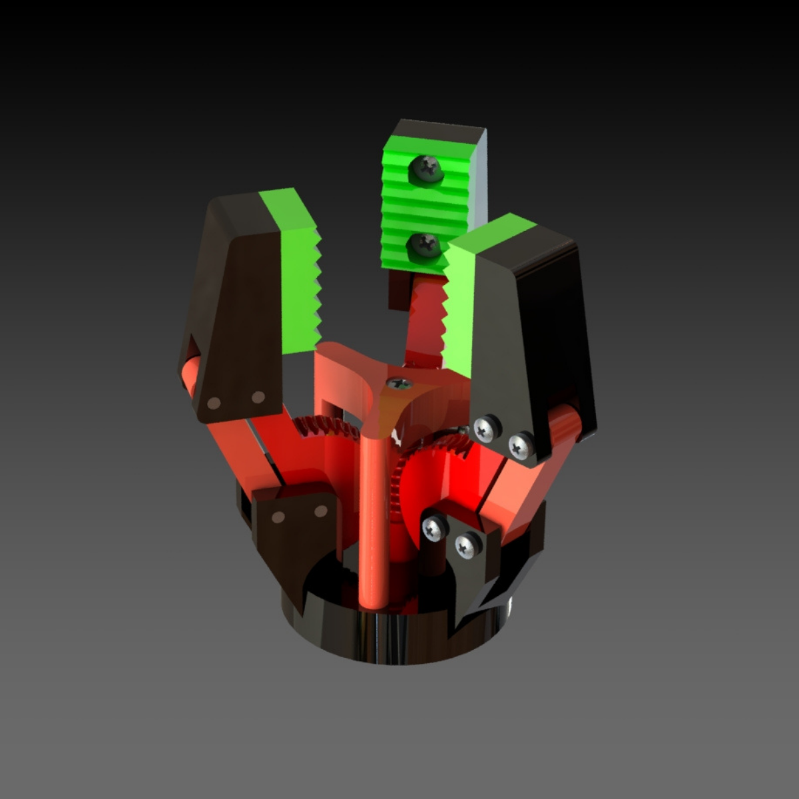

# 3D-Printable Gripper

A simple and fun 3D-printable gripper that anyone can print, build, and use — no robotics skills needed.

## What's Included

- `worm_screw.stl`: The worm screw
- `toothed_wheel.stl`: The toothed wheel (print **3 times**)
- `base.stl`: The main base
- `rear_arm.stl`: The rear arm (print **3 times**)
- `jaw.stl`: The jaw (print **3 times**)
- `closing_part.stl`: The closing part
- `jaw_flexible_part.stl`: The jaw flexible part (print **3 times**)

## How to Use

1. Download the STL files.
2. Open them in your 3D slicer software (e.g., Cura, PrusaSlicer).
3. Slice and print them using your 3D printer.
4. Assemble the parts.
5. Attach a motor to the bottom of the worm screw — the rotation of the motor will drive the gripper mechanism. Once assembled, you’re good to go!

## Preview of the Assembled Gripper

## License

This project is licensed under the [Creative Commons Attribution 4.0 International License](https://creativecommons.org/licenses/by/4.0/).
